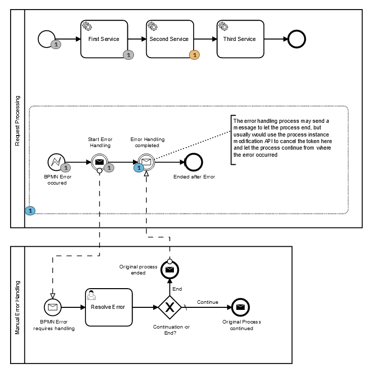

# continuation-after-bpmnerror

This project illustrates a generic error handler approach for bpmn errors, which allows the 
continuation of the process from the task in which the BPMN error event was thrown.

A BPMNError is thrown from one of the tasks

An event based sub process is used as a generic error handler, 
which initiates a separate error handling process. 

After the error handling process has resolved the issue, a process instance modification
is used to continue the process at the service task where it previously failed. 

